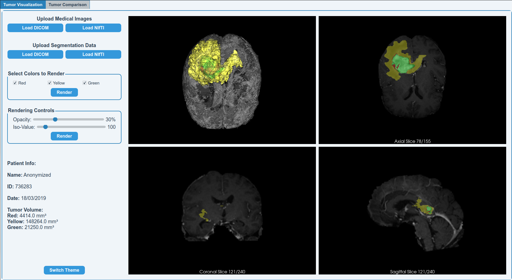
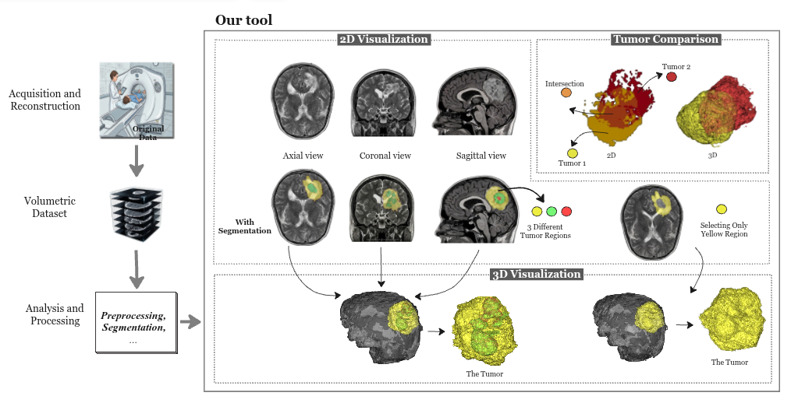
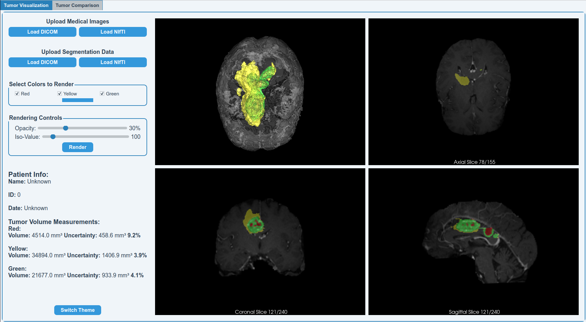
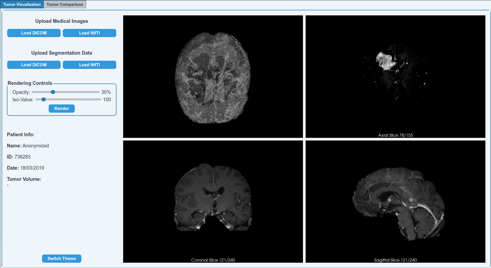
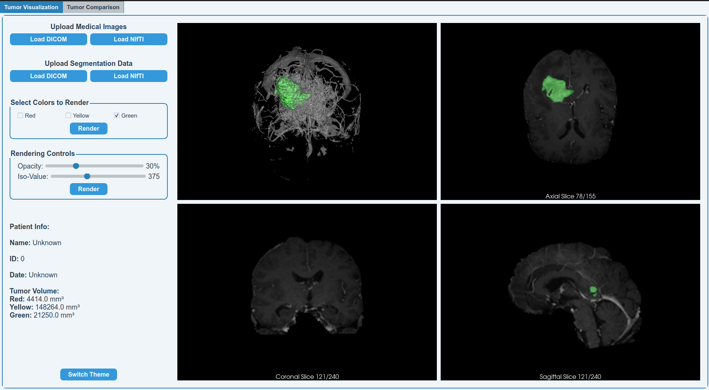
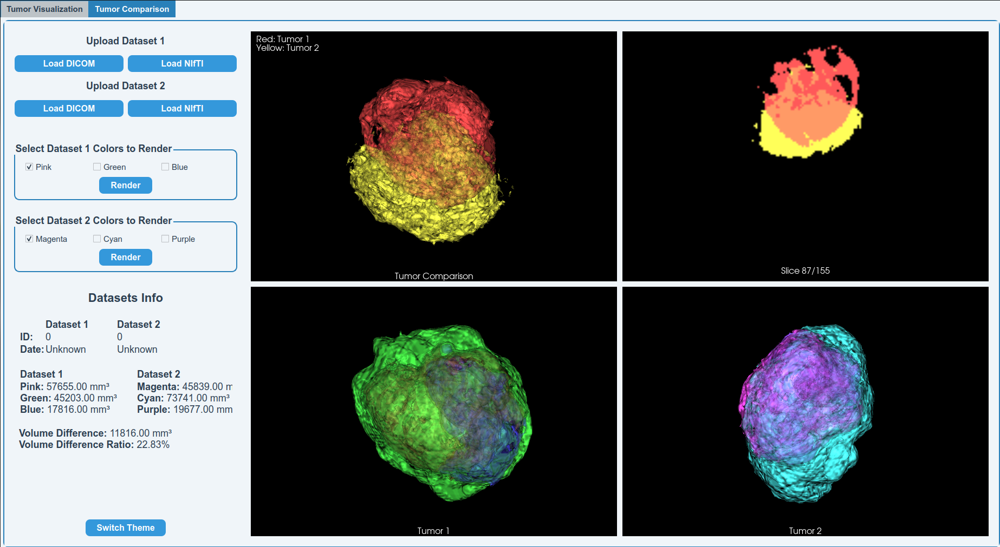

# AVATAR: interActive Visualization and Analysis system for Tumors with Assessed Reliability

## 1. Project Overview

Medical images are visual representations of interior structures and functions of the human body, and they play a central role in diagnosis, monitoring, and treatment. Modalities such as **Computed Tomography (CT)** and **Magnetic Resonance Imaging (MRI)** generate volumetric datasets composed of hundreds of stacked 2D slices. Manual slice-by-slice inspection of these datasets is time-consuming and produces observer-dependent interpretation.

AVATAR is an interactive Python/VTK system for volumetric tumor visualization and quantification, built on pre-segmented DICOM and NIfTI data. Existing tools tend to address visualization or quantification in isolation and rarely integrate both with longitudinal comparison. AVATAR closes this gap with three core modules:

- **2D multi-planar reconstruction (MPR)** with segmentation overlay, supporting up to ten tumor labels
- **Interactive 3D visualization** of anatomy and tumor regions, with user control over iso-value and opacity
- **Tumor comparison** across two time points, combining 2D/3D visual overlap with volume difference and uncertainty metrics

The system does not perform segmentation itself. Tumor segmentation is a well-studied problem with modality-specific methods of its own, and folding it in would extend the project's scope past visualization.

Three algorithmic choices in the pipeline (mesh smoothing, surface extraction, and rigid registration) had no clear best answer in prior literature for this context, so each was evaluated empirically against a specific gap in existing work. Details are in Section 4 and in the paper.

The system has been validated across nine datasets from local and international institutions, covering four anatomical regions and two imaging modalities, with structured feedback from oncologists, radiologists, and medical academics. It has since replaced a commercially licensed viewer at one local institution.

---

## Demo Video

[Alternative Link](https://drive.google.com/file/d/10Hwh5JYl1crnAystLpUWlMAg678aV8nE/view?usp=sharing)

## Workflow Video

[Alternative Link](https://drive.google.com/file/d/1PXO_y1WKpN0XHMJqqznOh4t4BCwODPoI/view?usp=sharing)

---

# 2. Implementation

## 2.1 Development Tools and Technologies

### VTK (Visualization Toolkit)

VTK is an open-source system for scientific visualization, computer graphics, and image processing, originally developed by Will Schroeder, Ken Martin, and Bill Lorensen. It provides 2D/3D visualization, surface extraction, image processing, mesh generation and smoothing, and medical image rendering.

**Source:** https://vtk.org

### Qt

Qt is a cross-platform framework for GUI development, used here for the application's widgets, layout, and interaction handling.

**Source:** https://www.qt.io

---

## 2.2 Surface Extraction

Volumetric data can be visualized through volume rendering or surface rendering. AVATAR uses surface rendering, which gives a clearer view of tumor boundaries and their spatial relationship to surrounding anatomy.

Marching Cubes (MC) is the standard algorithm for isosurface extraction, but AVATAR uses **Flying Edges (FE)** instead. FE avoids processing non-contributing regions and uses edge-based rather than cell-based traversal, which reuses intermediate computations more efficiently.

Across 75 MRI brain tumor cases spanning four TCIA collections and voxel counts from 1.5M to 54.5M, FE achieved a mean speedup of **6.56x** over MC, with the largest gains on the smallest volumes (7.68x) and the smallest gains on the largest (4.75x). The geometric cost, measured as the fractional increase in triangle count, averaged **5.66 × 10⁻³**, under six extra triangles per thousand, with no measurable downstream effect on mesh smoothing.

**Reference:** Schroeder, W., Maynard, R., & Geveci, B. *Flying Edges: A High-Performance Scalable Isocontouring Algorithm.* https://doi.org/10.1109/LDAV.2015.7348069

---

## 2.3 Mesh Smoothing and Surface Refinement

AVATAR uses two smoothing methods, each assigned to a different pipeline stage.

**Mumford–Shah framework** (3D tumor visualization). A variational method that treats denoising as an energy-minimization problem, balancing proximity to the original geometry against smoothness. It suppresses staircase artifacts from the voxel grid while preserving sharp boundaries. Evaluated on 150 segmentation records (50 BraTS 2020 cases x 3 labels), it preserved volume with an average change of **0.14 ± 0.25%**, well under the 5% clinical threshold, and kept surface deviations (Hausdorff and mean surface distance) below one voxel. This is the first medical feasibility evaluation of the method; prior work used non-medical data and general geometric metrics.

**Taubin's windowed sinc filter** (tumor comparison). A frequency-domain low-pass method that reduces high-frequency surface noise and mesh shrinkage, improving consistency between compared tumor surfaces.

---

## 2.4 Registration for Tumor Comparison

Before comparing tumors from different scans, AVATAR spatially aligns the datasets in two stages:

1. **Rigid registration** (CenteredVersorRigid3D, mean squares metric) corrects global positional differences.
2. **Deformable registration** (B-spline transform) handles local anatomical variation.

The rigid stage was chosen after comparing all four SimpleITK rigid-transform parameterizations (VersorRigid3D, Euler3D, CenteredVersorRigid3D, CenteredEuler3D) on 50 BraTS-Reg 2022 cases, scored on target registration error (TRE), Dice similarity (DSC), runtime, and iteration count. CenteredVersorRigid3D reached the best DSC (**0.937 ± 0.023**), with the two centered variants outperforming their non-centered counterparts on both accuracy metrics (Friedman test, p < 0.001 for TRE and DSC). Runtime was near-identical across all four (6.92–7.10s, ~10 iterations), so the choice came down to accuracy. Prior comparisons of ITK rigid methods varied metric, interpolator, and optimizer choice rather than the transform type itself.

---

# 3. System Features

## 3.1 Medical Image Loading

Supports **DICOM** and **NIfTI**. Uploaded datasets are validated (non-empty DICOM directory, or a valid `.nii`/`.nii.gz` extension) before being accepted into the pipeline.

## 3.2 2D Slice Visualization (MPR)

Interactive navigation through **axial**, **coronal**, and **sagittal** planes.

## 3.3 Segmentation Visualization

- Overlays segmentation masks on 2D slices at 50% opacity
- Renders segmented tumor regions in 3D
- Assigns a distinct color per label, up to ten labels
- Lets the user select which regions to display, in both 2D and 3D

## 3.4 Tumor Volume Calculation

Volume is computed per segmentation label from voxel count and physical voxel spacing extracted from the image metadata.

## 3.5 Partial Volume Correction (PVC) and Uncertainty Estimation

Boundary voxels often contain a mix of tumor and non-tumor tissue (the partial volume effect), which biases raw volume estimates. AVATAR applies a model-based, shape-specific **Recovery Coefficient (RC)** correction: the segmentation mask is convolved with a Gaussian kernel representing the scanner's point spread function, and the resulting RC is used to correct voxel intensities before volume is recalculated. This avoids the idealized-sphere assumption used by conventional model-based RC methods, since it derives the shape from the actual segmentation.

## 3.6 Image Windowing (Contrast and Brightness)

Manual brightness and contrast adjustment to improve visibility of specific tissue types.

## 3.7 Opacity and Iso-Value Control

- **Opacity** controls 3D model transparency
- **Iso-value** sets the surface extraction threshold

## 3.8 Tumor Comparison

Compares two tumors from different scans, after rigid + deformable registration and surface smoothing:

- 2D and 3D comparison views, with each time point in a distinct color and overlap shown as a blended color
- Volume difference calculation (absolute and percentage)
- Structural shape comparison

Useful for tracking progression, evaluating treatment response, and monitoring longitudinal change.

## 3.9 Theme Support

Light and dark mode.

---

# 4. Evaluation

Full methodology, statistical tests, and per-case results are in the paper (Sections 4–5). Summary:

| Evaluation | Result |
|---|---|
| Flying Edges vs. Marching Cubes (75 cases, 4 TCIA collections) | 6.56x mean speedup, 5.66 × 10⁻³ mean triangle-count increase |
| Mumford–Shah mesh smoothing (150 records, BraTS 2020) | 0.14 ± 0.25% volume change, HD 0.249 ± 0.018mm, MSD 0.195 ± 0.012mm |
| Rigid registration: 4 ITK transforms (50 cases, BraTS-Reg 2022) | CenteredVersorRigid3D best DSC (0.937 ± 0.023); centered variants beat non-centered on accuracy (p < 0.001) |

## 4.1 Dataset Testing

Tested on nine datasets total:

- Four local datasets from West Bank institutions (Alia Governmental Hospital, Al-Ahli Hospital, Istishari Arab Hospital, Palestinian Cancer Patients Charity Association), covering brain and breast cases, collected under institutional ethical approval and fully anonymized. Segmentation was done in collaboration with a radiologist using 3D Slicer, since the participating institutions lack in-house segmentation capability.
- Five public TCIA datasets covering brain, lung, breast, and liver, in both MRI and CT, and both DICOM and NIfTI: BraTS 2020, Brain-Tumor-Progression, NSCLC, EA1141, HCC-TACE-Seg.

## 4.2 User Testing

Feedback sessions were held with 12 medical professionals: 3 oncologists, 5 radiologists, 4 medical academics.

- **Oncologists** valued the MPR views, dynamic iso-value control, and the quantitative volume/percentage-difference output in tumor comparison. They asked for built-in segmentation and UI refinements.
- **Radiologists** valued the reliance on segmentation (absent from their current hospital workstations) and the contrast/brightness controls. They asked for interactive distance and angle measurement tools.
- **Medical academics** valued ease of use, the DICOM/NIfTI dual support versus their institution's licensed viewer, and the volume uncertainty measure. AVATAR has since replaced that commercial viewer at their institution. They asked for auto-generated reports combining volume, uncertainty, and patient metadata.

---

# 5. Limitations

1. Requires pre-segmented input; result quality depends on segmentation quality.
2. Supports up to ten segmentation labels.
3. The medical image and its segmentation must share the same format (both DICOM or both NIfTI).
4. Partial volume correction falls back to a default FWHM (1.0) when the scanner's FWHM isn't present in metadata, which can bias the estimate.
5. User testing sample size (n = 12) is small; broader clinical validation is needed before generalizing.

---

# 6. Conclusion

AVATAR is an interactive visualization system for pre-segmented volumetric tumor data, combining 2D MPR, interactive 3D rendering, longitudinal tumor comparison, and volume calculation with uncertainty estimation in a single pipeline. Beyond the system itself, the project contributes the first medical feasibility evaluation of Mumford–Shah mesh denoising, a characterization of Flying Edges speedup as a function of input complexity rather than thread count, a quantified geometric cost for that speedup, and the first comparison of ITK's four rigid-transform parameterizations against a shared accuracy/runtime metric set.

## Future Work

- Built-in tumor segmentation
- AI-based tumor classification
- Deep learning-based registration
- Real-time GPU acceleration
- Interactive distance/angle measurement tools
- Auto-generated reports (volume, uncertainty, patient metadata)
- Advanced uncertainty visualization

---

# Authorship

## Main Author

Sarah Abu Irmeileh
- Medical Computing Researcher 
- sarahabuirmeileh@gmail.com

## Supervisor

Dr. Zein Salah
- Assistant Professor, College of Computer Engineering and Information Technology, Palestine Polytechnic University

## Acknowledgments

Dr. Hani Salah and Dr. Majed Dwiek, for research and clinical guidance and for connecting the project with clinical staff. The medical staff at Alia Governmental Hospital, Al-Ahli Hospital, Istishari Arab Hospital, and the Palestinian Cancer Patients Charity Association, for data and feedback.

---

# License

This project is for academic and research purposes. Please cite it if you reference or build on this work.